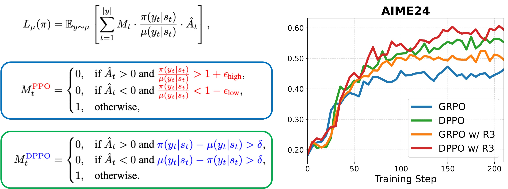
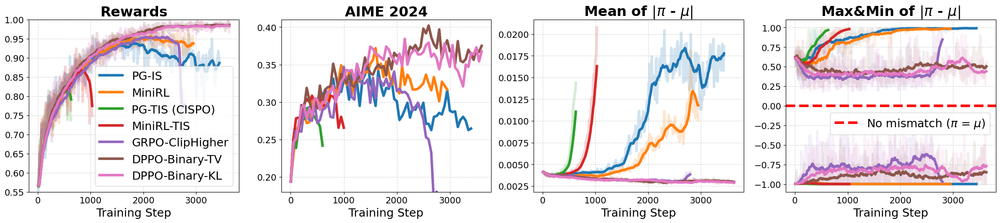
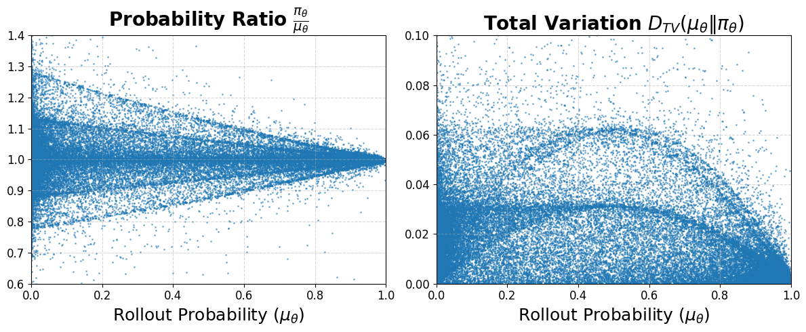
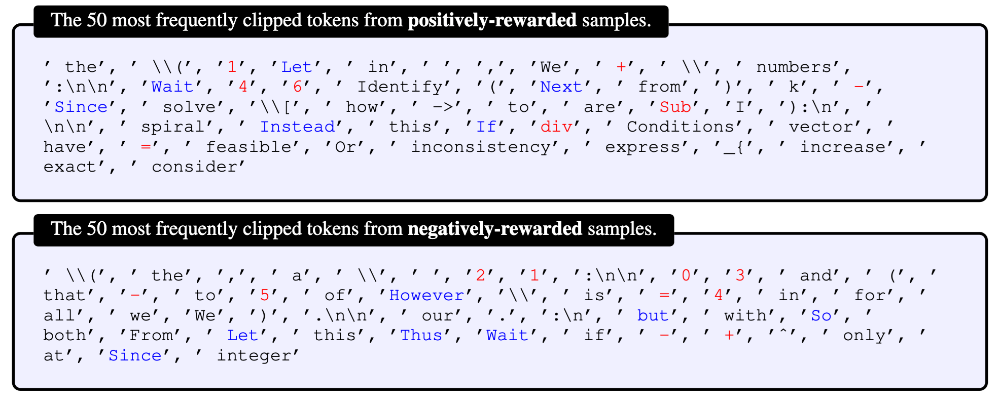

<div align="center">

# Rethinking the Trust Region in LLM Reinforcement Learning
[Penghui Qi*](https://scholar.google.com/citations?user=CLRsGEMAAAAJ&hl=en), [Xiangxin Zhou*](https://zhouxiangxin1998.github.io/), [Zichen Liu](https://lkevinzc.github.io/)
[Tianyu Pang](https://p2333.github.io/), [Chao Du](https://duchao0726.github.io/), [Min Lin](https://scholar.google.com.sg/citations?user=BGONmkIAAAAJ&hl=en), [Wee Sun Lee](https://scholar.google.com/citations?user=8PCrLgwAAAAJ&hl=en)

[](https://arxiv.org/pdf/2602.04879)
[](https://github.com/sail-sg/Stable-RL)

</div>


## Overview


Comparison of **PPO** and the proposed **DPPO** (the Binary-TV variant). **(Left)** The surrogate objective and corresponding masks for PPO and DPPO. PPO (and variants like GRPO) employs a heuristic mask based on the probability ratio. In contrast, DPPO utilizes a more principled mask based on a direct approximation of policy divergence (e.g., Total Variation), ensuring updates stay within a theoretically grounded trust region. **(Right)** Experimental results on the AIME24 using Qwen3-30B-A3B-Base. DPPO significantly outperforms GRPO baselines, achieving superior training efficiency and stability even without rollout routing replay (R3).


DPPO variants achieve stable training while controlling the training-inference mismatch at a low level. In contrast, methods without a trust region (PG-IS, CISPO) or with a misspecified one (MiniRL) suffer from growing mismatch and eventual collapse.



The plots show numerical differences between a training and an inference engine for Qwen3-30B-A3B-Base with identical parameters. **(Left)** The probability ratio (used in PPO) is highly volatile for low-probability tokens. **(Right)** In contrast, the TV divergence is more stable. This highlights a key flaw of PPO's clipping mechanism: it **over-penalizes low-probability tokens**, which can slow down learning; and **under-penalizes high-probability tokens**, which can permit large, destabilizing updates.


The most frequently clipped tokens (by GRPO) are important to the reasoning task! 
They are dominated by:
- numbers, like 1, 4
- mathematical symbols, like +, -, =
- reasoning and structural Words: Wait, Thus, Next

## Code

The code change for DPPO-Binary-TV/DPPO-Binary-KL is super simple, can refer to [core_algo.py](verl/trainer/ppo/core_algos.py) for implementation details.

This repo shows an example on how to implement the TopK divergence approximation.

## Citation
If you find our works useful for your research, please consider citing:

```bibtex
@article{qi2026stablerl,
  title={Rethinking the Trust Region in LLM Reinforcement Learning},
  author={Qi, Penghui and Zhou, Xiangxin and Liu, Zichen and Pang, Tianyu and Du, Chao and Lin, Min and Lee, Wee Sun},
  journal={arXiv preprint arXiv:2602.04879},
  year={2026}
}
```
